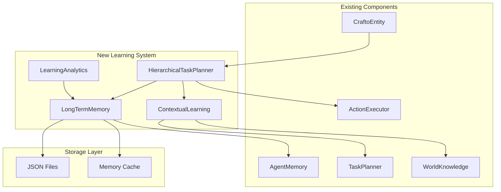

# Design Document

## Overview

The AI Learning Improvements system enhances the existing Crafto AI with advanced learning capabilities, hierarchical task planning, and contextual adaptation. This system builds upon the current `AgentMemory`, `TaskPlanner`, and `WorldKnowledge` components to create a more intelligent and adaptive AI that learns from experience and improves over time.

The system consists of three main components:
1. **LongTermMemory** - Persistent cross-session learning and strategy optimization
2. **HierarchicalTaskPlanner** - Advanced multi-level task decomposition and execution
3. **ContextualLearning** - Environment-aware behavior adaptation

## Architecture

### System Architecture Diagram



### Component Integration

The new learning system integrates with existing components as follows:

- **CraftoEntity** → **HierarchicalTaskPlanner**: Main entry point for complex task execution
- **HierarchicalTaskPlanner** → **LongTermMemory**: Records and retrieves successful strategies
- **ContextualLearning** → **WorldKnowledge**: Analyzes environmental context for decision making
- **LongTermMemory** → **AgentMemory**: Enhances existing memory with persistent learning
- **HierarchicalTaskPlanner** → **ActionExecutor**: Executes decomposed subtasks

## Components and Interfaces

### 1. LongTermMemory

**Purpose**: Provides persistent learning capabilities across game sessions with strategy optimization and player behavior analysis.

**Key Interfaces**:
```java
public class LongTermMemory {
    // Strategy Management
    public void recordSuccessfulStrategy(String taskType, String context, String strategy, double successRate)
    public Optional<SuccessfulStrategy> getBestStrategy(String taskType, String context)
    
    // Player Behavior Analysis
    public void recordPlayerBehavior(String playerName, String action, String context, boolean wasSuccessful)
    public PlayerPreferences getPlayerPreferences(String playerName)
    
    // Feedback System
    public void recordFeedback(String playerName, String craftoName, String task, int rating, String comment)
    
    // Analytics
    public LearningStats getLearningStats()
}
```

**Data Models**:
- `SuccessfulStrategy`: Stores strategy details, success rate, usage count, and last used timestamp
- `PlayerPattern`: Tracks player behavior patterns and preferences
- `FeedbackEntry`: Records player feedback with ratings and comments
- `LearningStats`: Provides analytics on learning progress

### 2. HierarchicalTaskPlanner

**Purpose**: Decomposes complex tasks into manageable subtasks with dependency management and parallel execution.

**Key Interfaces**:
```java
public class HierarchicalTaskPlanner {
    // Task Planning
    public CompletableFuture<TaskResult> planAndExecute(String command, String context)
    public void replanIfNeeded()
    
    // Status Monitoring
    public TaskExecutionStatus getExecutionStatus()
    
    // Task Management
    private List<TaskNode> decomposeTask(TaskNode rootTask)
    private void establishDependencies(TaskNode rootTask, List<TaskNode> subtasks)
    private boolean canExecuteNow(TaskNode task)
}
```

**Task Types**:
- `BUILD_STRUCTURE`: Multi-phase construction projects
- `GATHER_RESOURCES`: Resource collection with optimization
- `COMBAT`: Tactical combat with preparation phases
- `EXPLORATION`: Systematic area exploration
- `SIMPLE`: Single-action tasks

### 3. ContextualLearning

**Purpose**: Adapts AI behavior based on environmental context, time, weather, and social factors.

**Key Interfaces**:
```java
public class ContextualLearning {
    // Context Analysis
    public EnvironmentalContext analyzeCurrentContext(CraftoEntity crafto)
    public BehaviorModification suggestBehaviorModification(String taskType, EnvironmentalContext context)
    
    // Learning from Others
    public void observeOtherCrafto(CraftoEntity observer, CraftoEntity observed, String action, boolean success)
    public List<LearningInsight> getSharedKnowledge(String taskType)
    
    // Risk Assessment
    public RiskAssessment assessRisk(BlockPos position, EnvironmentalContext context)
}
```

**Context Factors**:
- Time of day and weather conditions
- Biome and terrain characteristics
- Presence of other entities (players, mobs, Crafto)
- Resource availability and danger levels

## Data Models

### Core Data Structures

```java
// Strategy Storage
public class SuccessfulStrategy {
    private String taskType;
    private String context;
    private String strategy;
    private double successRate;
    private LocalDateTime lastUsed;
    private int usageCount;
}

// Task Hierarchy
public class TaskNode {
    private String id;
    private String description;
    private TaskType type;
    private TaskPriority priority;
    private TaskStatus status;
    private String parentId;
    private LocalDateTime creationTime;
}

// Environmental Context
public class EnvironmentalContext {
    private TimeOfDay timeOfDay;
    private WeatherCondition weather;
    private BiomeType biome;
    private List<EntityPresence> nearbyEntities;
    private DangerLevel dangerLevel;
    private Map<ResourceType, Integer> availableResources;
}

// Learning Analytics
public class LearningStats {
    private int totalStrategies;
    private int trackedPlayers;
    private int feedbackEntries;
    private double averageSuccessRate;
    private String mostSuccessfulTaskType;
}
```

### File Storage Format

Learning data is stored in JSON format in the `config/crafto/memory/` directory:

- `strategies.json`: Successful strategies with metadata
- `player_patterns.json`: Player behavior patterns and preferences
- `feedback.json`: Player feedback history
- `contextual_rules.json`: Context-specific behavior rules

## Error Handling

### Strategy Management Errors
- **Invalid Strategy Data**: Validate strategy format before storage
- **Corrupted Memory Files**: Implement backup and recovery mechanisms
- **Memory Overflow**: Automatic cleanup of old/unused strategies

### Task Planning Errors
- **Circular Dependencies**: Detect and resolve dependency cycles
- **Resource Conflicts**: Handle concurrent resource access
- **Execution Timeouts**: Implement retry logic with exponential backoff

### Context Analysis Errors
- **Missing Context Data**: Provide default behavior when context is unavailable
- **Sensor Failures**: Graceful degradation when world scanning fails
- **Performance Issues**: Limit context analysis frequency and scope

### Recovery Mechanisms
```java
// Automatic error recovery
public class ErrorRecovery {
    public void handleMemoryCorruption() {
        // Load from backup, reset to defaults if necessary
    }
    
    public void handleTaskFailure(TaskNode task) {
        // Retry with alternative strategy or mark as failed
    }
    
    public void handleContextUnavailable() {
        // Use cached context or default behavior
    }
}
```

## Testing Strategy

### Unit Testing
- **LongTermMemory**: Test strategy storage, retrieval, and cleanup
- **HierarchicalTaskPlanner**: Test task decomposition and dependency resolution
- **ContextualLearning**: Test context analysis and behavior modification

### Integration Testing
- **Memory Integration**: Test interaction with existing AgentMemory
- **Task Execution**: Test integration with ActionExecutor
- **Performance**: Test memory usage and response times under load

### Test Data
```java
// Test scenarios
public class TestScenarios {
    // Learning scenarios
    public void testStrategyLearning() {
        // Record multiple strategies, verify best one is selected
    }
    
    // Task planning scenarios
    public void testComplexTaskDecomposition() {
        // Test building task breakdown into subtasks
    }
    
    // Context adaptation scenarios
    public void testNightBehaviorAdaptation() {
        // Verify behavior changes during night time
    }
}
```

### Performance Benchmarks
- Memory usage should not exceed 500MB additional overhead
- Strategy lookup should complete within 100ms
- Task decomposition should complete within 2 seconds
- Context analysis should complete within 500ms

## Performance Considerations

### Memory Management
- **Caching Strategy**: LRU cache for frequently accessed strategies
- **Data Compression**: Compress historical data older than 7 days
- **Cleanup Policies**: Remove unused strategies after 30 days

### Concurrent Access
- **Thread Safety**: Use ConcurrentHashMap for shared data structures
- **Lock-Free Operations**: Minimize synchronization overhead
- **Async Processing**: Use CompletableFuture for long-running operations

### Optimization Techniques
```java
// Performance optimizations
public class PerformanceOptimizations {
    // Batch operations to reduce I/O
    public void batchSaveStrategies(List<SuccessfulStrategy> strategies) {
        // Save multiple strategies in single operation
    }
    
    // Predictive caching
    public void preloadLikelyStrategies(String taskType) {
        // Load related strategies before they're needed
    }
    
    // Lazy loading
    public Optional<ContextualRule> getContextualRule(String context) {
        // Load rules on-demand
    }
}
```

### Monitoring and Metrics
- Track learning system performance with Micrometer metrics
- Monitor memory usage and garbage collection impact
- Log slow operations for optimization opportunities
- Provide JMX beans for runtime monitoring

## Security Considerations

### Data Validation
- Validate all input data before processing
- Sanitize strategy descriptions to prevent injection attacks
- Limit strategy storage size to prevent DoS attacks

### Access Control
- Restrict file system access to designated directories
- Validate file paths to prevent directory traversal
- Implement rate limiting for learning operations

### Privacy Protection
- Hash player names in storage for privacy
- Provide data deletion capabilities for GDPR compliance
- Encrypt sensitive learning data if required

## Migration and Compatibility

### Backward Compatibility
- Maintain compatibility with existing AgentMemory format
- Provide migration utilities for existing data
- Support gradual rollout of new features

### Data Migration
```java
public class DataMigration {
    public void migrateFromAgentMemory(AgentMemory oldMemory) {
        // Convert existing memory to new format
    }
    
    public void upgradeDataFormat(String version) {
        // Handle format changes between versions
    }
}
```

### Configuration Management
- Provide configuration options for learning parameters
- Allow disabling specific learning features
- Support different learning modes (aggressive, conservative, balanced)